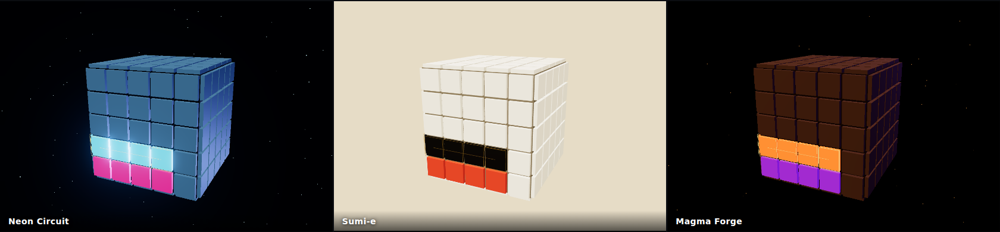

# Cube⁵

Five-in-a-row played on the **surface of a cube**. A row does not stop at the
edge of a face — it rolls over onto the next one and keeps going straight, so
the threat that beats you is usually on the face you are not looking at.

A three.js remake of an Android/iOS game from 2012, with Steam peer-to-peer
multiplayer, a computer opponent at three difficulties, configurable board
sizes, and three switchable visual themes.



## Rules

- The board is all six faces of an N×N×N cube: `6N²` tiles.
- Players alternate claiming empty tiles. **Five in a row wins.**
- Rows wrap across face edges. A straight row circles the whole cube in `4N`
  tiles, so on a small cube every win has to travel around it — there is no
  five-in-a-row on a single 2×2 or 4×4 face.
- Diagonals wrap over edges too, but they **stop at the cube's eight corners**,
  where three faces meet with only 270° of surface and a diagonal has no
  well-defined continuation.
- Board sizes run from 2 to 9 per face (24 to 486 tiles).

## Running it

```sh
npm install
npm start        # Electron
npm test         # rules and topology tests, no display needed
```

For online play, Steam must be running and signed in. The app initialises
Steamworks with **App ID 480** (Spacewar, Valve's public test app), so anyone
with a Steam account can host and join without an app of their own.

### A caveat about App ID 480

Every Steamworks test build in the world shares App ID 480, so the public lobby
list is noisy and the in-app browser filters it down to lobbies tagged as
Cube⁵ — which can leave it empty even when a friend is hosting. Two reliable
paths:

- **Paste the lobby ID.** The host's waiting screen shows it; *Join a game →*
  paste → *Join*.
- **Steam invite.** *Invite via Steam* opens the overlay's invite dialog, and
  accepting from the friends list drops the guest straight into the game.

`steam_appid.txt` in the repo root is what tells the Steam client which app is
running during development. Ship a real App ID by changing `APP_ID` in
`electron/main.cjs` and that file.

Without Steam the menu says so and online play is disabled; **Play the
computer** and **two players, one screen** still work, and are the quickest way
to try the game.

## The computer opponent

Every candidate cell is judged by sliding a five-window along each of the four
line axes through it and counting the windows still *live* — free of opponent
stones, and free of the walls where a diagonal dies at a cube corner. A window
holding four of my stones is one move from a win; holding two it is a distant
promise. Counting live windows rather than matching literal patterns means
gapped shapes (`oo.oo`) and lines that roll over a face edge need no special
case. Each cell is scored for the opponent too, since a cell that is valuable
to them is worth denying. Search is confined to cells within a step or two of
an existing stone.

What separates the levels is how much of that signal each is allowed to act on.

| | |
|---|---|
| **Easy** | Always takes a win, but notices your winning move only about half the time, and wanders off the best line roughly a third of the time. |
| **Medium** | Always takes a win, always blocks yours, and will not let a double-four stand. Picks loosely among its near-best moves so it does not play the same game twice. |
| **Hard** | Adds forks — two threats at once cannot both be answered — and plays out its leading moves to see what your best reply would be worth, discounting anything that hands back more than it creates. |

Measured over 20 games a side on a 5-cube: hard beat easy 20–0, medium beat
easy 20–0, and hard beat medium 17–2. A move costs under 2 ms at medium and
around 25 ms at hard, so it runs on the main thread; the pause before it plays
is deliberate, not the search.

## Themes

Switchable mid-game from the bar in the bottom right. Each one owns its
clear colour, materials, light rig, bloom settings, ambient particles and the
HUD palette.

| | |
|---|---|
| **Neon Circuit** | Cold cyan and magenta on a black starfield, with bloom. |
| **Sumi-e** | Ink and vermilion stones on ivory tiles, warm paper ground, no glow. |
| **Magma Forge** | Molten orange against plasma violet on cooled basalt, drifting embers. |

## How it is put together

```
electron/main.cjs    Steam: lobbies, P2P packets, callbacks. The only place
                     the native module is touched.
electron/preload.cjs contextBridge: plain JSON in, plain JSON out.
src/js/cube.js       Cube topology — cells, face frames, and the edge-folding
                     walk that makes a line stay straight around the cube.
src/js/game.js       Rules: legality, turn order, win detection. Pure logic.
src/js/view.js       three.js scene, tiles, picking, camera work.
src/js/themes.js     The three themes.
src/js/ai.js         The computer opponent: threat scoring and the three
                     difficulty ladders.
src/js/net.js        Wire protocol and the renderer half of the bridge.
src/js/main.js       Controller tying the three together.
```

### The interesting part: walking a line around a cube

Cell centres live on a doubled integer lattice, so a cube of size N spans
`[-N, N]` and every centre has exactly one coordinate at `±N` — all of the
geometry is exact integer arithmetic with no floating-point comparisons.

A step is `p + 2d`. If the result overshoots the face, `CubeTopology.step`
rotates both the position and the direction 90° about the shared edge, which
drops the line onto the neighbouring face still heading "straight". Overshoot
on two axes at once means the line hit a cube corner, and it ends there.

Win detection walks out from the placed stone along the four line axes of its
face, in both directions, with a visited set so a fully-owned ring on a small
cube cannot be double-counted.

`npm test` covers this: lattice round-trips, every step landing on a real
neighbour with a tangent heading, reversibility, orthogonal rings closing after
exactly `4N` cells with their original heading, exactly 24 corner-blocked
diagonals, and wins that wrap across faces.

### Networking

Turn-based, so there is no prediction or rollback: both peers run the same
rules object and exchange moves over reliable Steam P2P packets. The host owns
matchmaking and the game configuration, announces who moves first, and is the
only side that issues `start`. Moves carry a sequence number and are rejected
if they arrive out of order, if it is not the sender's turn, or if the cell is
not legal.

## Not included

Deliberately scoped to the core game: no match history, no chat, no ranking.
